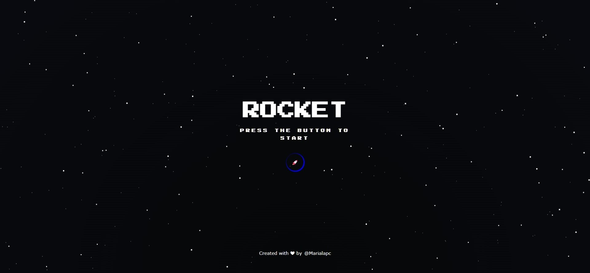
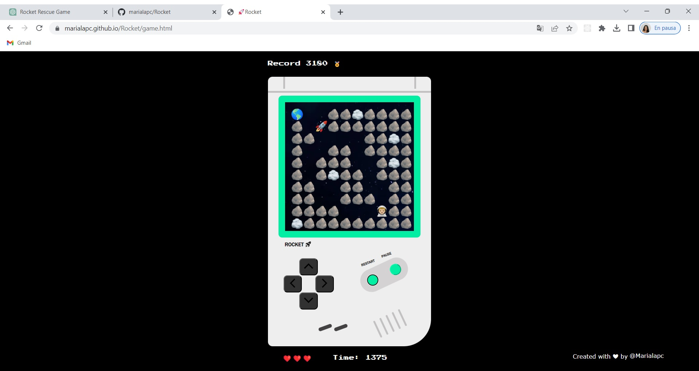

# 🚀 Rocket

### Minijuego en línea desarrollado con **HTML**, **Canvas**, **CSS** y **JavaScript**.

#### Rescata al astronauta en 7 niveles diferentes en el menor tiempo posible.

## 📺 Preview

## 🕹️ Cómo jugar

Para empezar a jugar, simplemente haz clic en el botón de la página principal del juego. Una vez que comience el juego, controlarás un cohete que puede moverse hacia arriba, abajo, izquierda y derecha con las teclas de flecha de tu teclado o botones de la GameBoy.

El objetivo es llegar al astronauta en cada nivel en el menor tiempo posible y batir tu propio record. Si colisionas con algún obstáculo en el camino, perderás una vida. Tienes tres vidas en total. Si pierdes todas tus vidas, el juego terminará y comenzarás de nuevo desde el primer nivel.

## 🎮 Controles del juego

- Flecha hacia arriba: mueve el cohete hacia arriba.
- Flecha hacia abajo: mueve el cohete hacia abajo.
- Flecha hacia la izquierda: mueve el cohete hacia la izquierda.
- Flecha hacia la derecha: mueve el cohete hacia la derecha.
- Botón Pause: pausa el juego.
- Botón Restart: reanuda el juego.

## 💻 Tecnologías utilizadas

- Lenguajes:
  - Lenguaje de marcado: **HTML5**.
  - Lenguaje de estilos: **CSS avanzado con diseño responsive**.
  - Lenguaje de programación: **Vanilla JS**.

## 👩🏽‍💻 Autora:

María Lopez: [@marialapc](https://github.com/marialapc)
